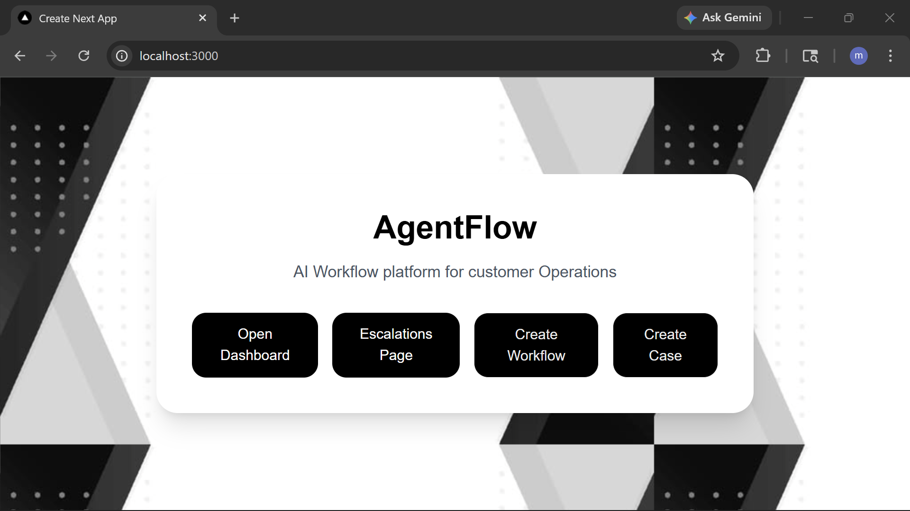
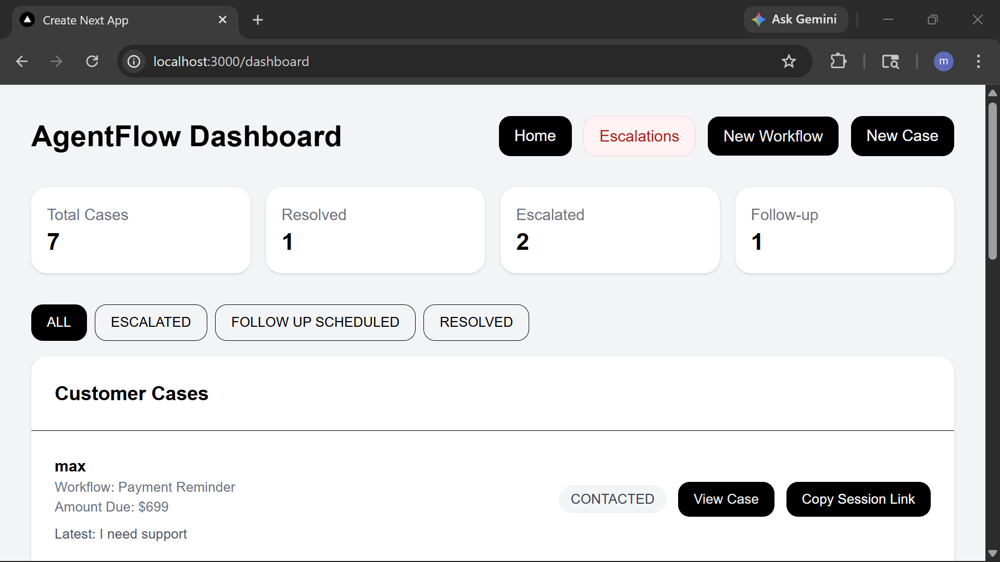
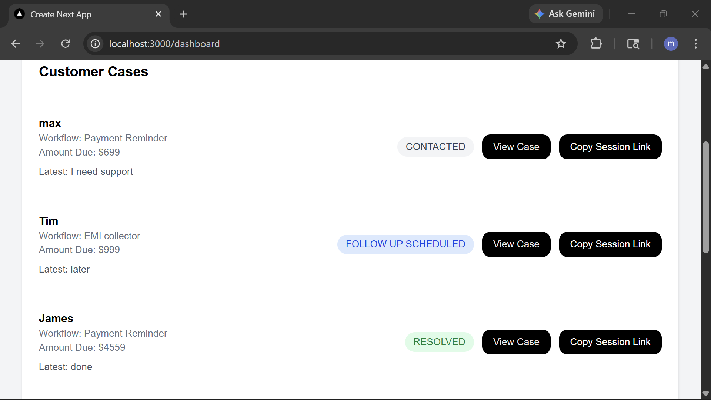
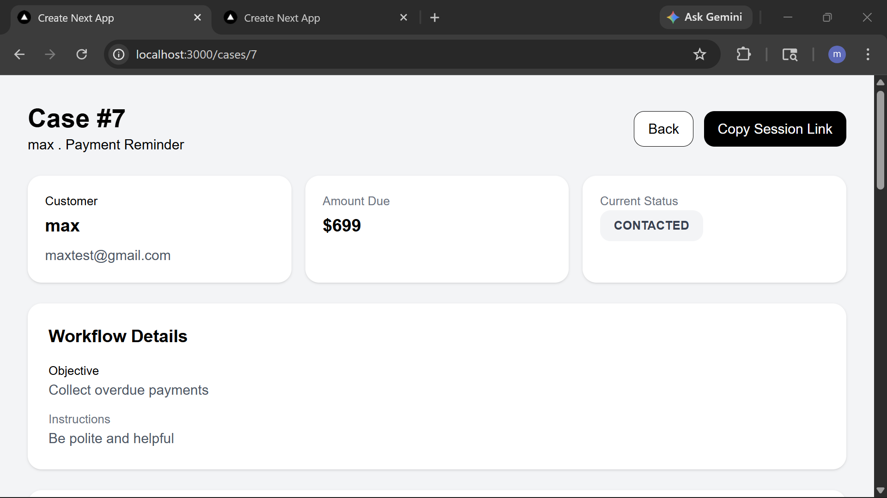
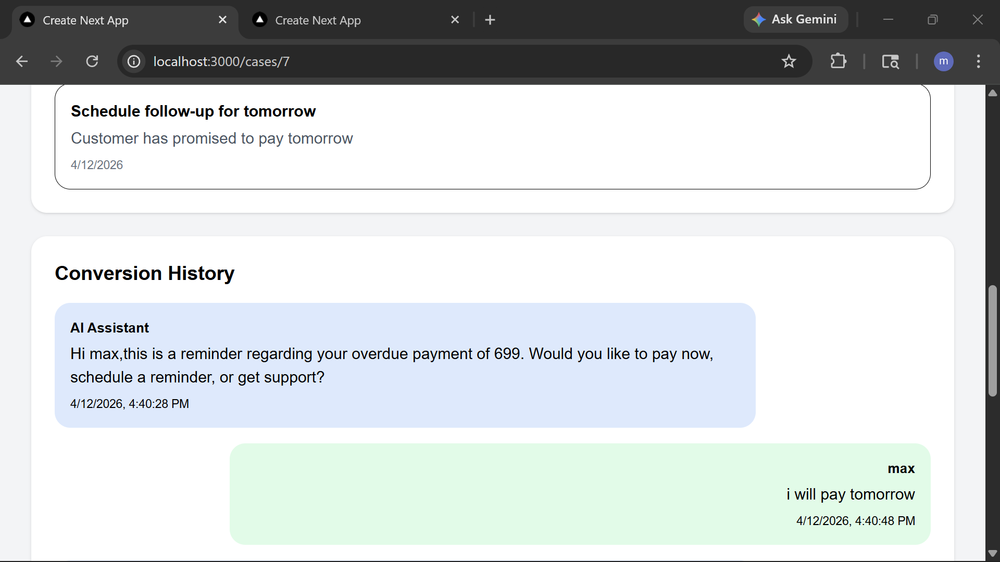
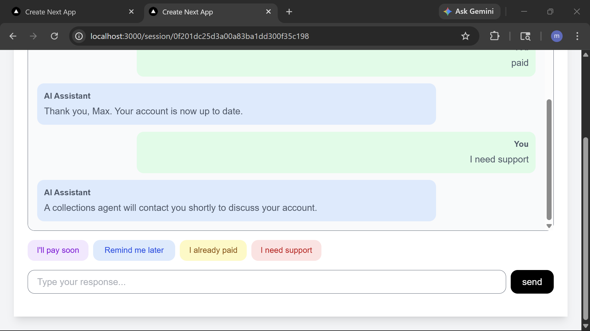
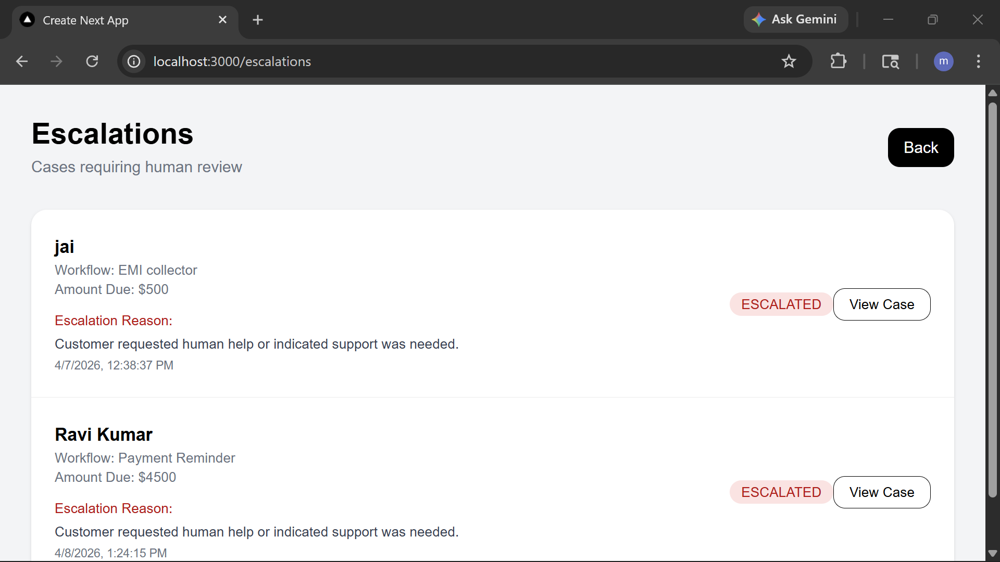

# AgentFlow

AgentFlow is a simple AI-powered workflow system designed to handle customer cases end-to-end.

Instead of acting like a chatbot, it treats each interaction as part of a **structured workflow** — where messages lead to actions, and actions update real business state.

---

## Demo

🎥 Watch the demo:
[YT link](https://youtu.be/YDY-160MWvc)

---

## What it does

* Handles customer conversations through a dedicated session link
* Interprets responses using AI (with rule-based fallback)
* Updates case status automatically (e.g. follow-up, resolved, escalated)
* Tracks actions and reasoning for each decision
* Surfaces escalated cases for human review

---

## Screens

### Home




### Dashboard



### Cases



### Case Detail



### Case Detail-2



### Customer Session



### Escalations



---

## Tech Stack

* Next.js (frontend)
* Node.js + Express + TypeScript (backend)
* PostgreSQL (database)
* Prisma (ORM)
* Groq (LLM)

---

## Running locally

Clone the repo:

```bash
git clone https://github.com/mahidhar2026/agentFlow.git
cd agentflow
```

### Backend

```bash
cd backend
npm install
```

Create `.env`:

```
DATABASE_URL=your_db_url
GROQ_API_KEY=your_key
```

Run:

```bash
npx prisma db push
npm run dev
```

---

### Frontend

```bash
cd frontend
npm install
npm run dev
```

---

## Notes

This project focuses more on **system behavior and workflow design** .

It’s meant to explore how AI can be used to:

* manage stateful processes
* take structured actions
* integrate into business logic

---

## Author

Mahidhar Agraharapu
